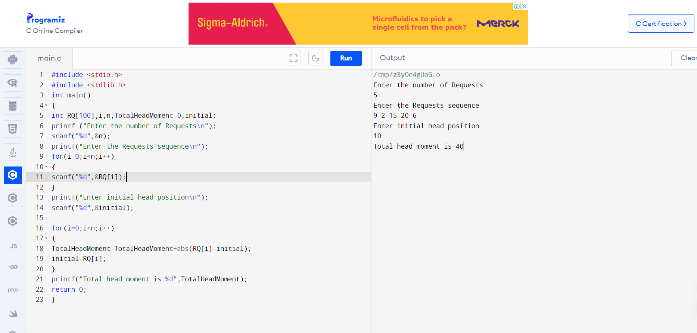
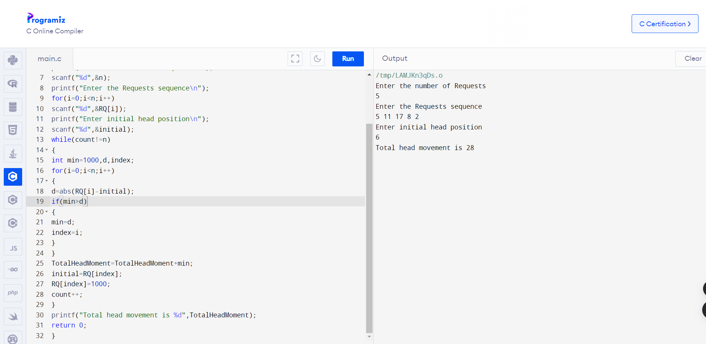
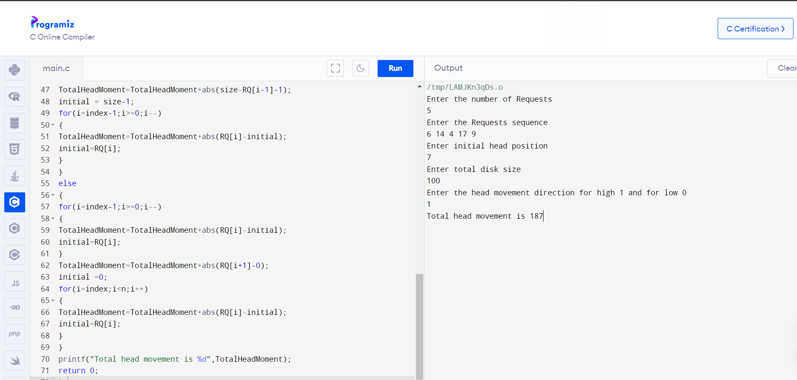
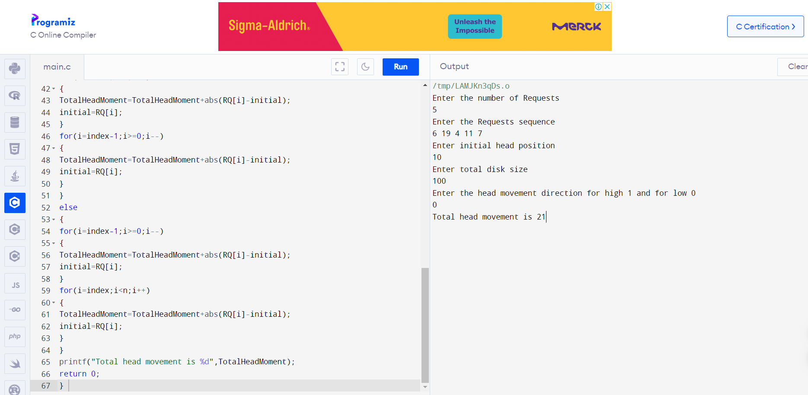

# OS-EX.11-IMPLEMENTATION-OF-DISK-SCHEDULING-ALGORITHMS

## DISK SCHEDULING FIRST COME FIRST SERVE 

## AIM:

To write a program for the first come first serve method of disc scheduling.

## PROGRAM:

```
#include <stdio.h>
#include <stdlib.h>
int main()
{
int RQ[100],i,n,TotalHeadMoment=0,initial;
printf ("Enter the number of Requests\n");
scanf("%d",&n);
printf("Enter the Requests sequence\n");
for(i=0;i<n;i++)
{
scanf("%d",&RQ[i]);
}
printf("Enter initial head position\n");
scanf("%d",&initial);

for(i=0;i<n;i++)
{
TotalHeadMoment=TotalHeadMoment+abs(RQ[i]-initial);
initial=RQ[i];
}
printf("Total head moment is %d",TotalHeadMoment);
return 0;
}
```

## OUTPUT:



## RESULT:

Thus the implementation of the program for first come first serve disc scheduling has been
successfully executed.


## DISK SCHEDULING SHORTEST SEEK TIME FIRST  

## AIM:

To write a program for the shortest seek time first method of disc scheduling. 

## PROGRAM:

```
#include<stdio.h>
#include<stdlib.h>
int main()
{
int RQ[100],i,n,TotalHeadMoment=0,initial,count=0;
printf("Enter the number of Requests\n");
scanf("%d",&n);
printf("Enter the Requests sequence\n");
for(i=0;i<n;i++)
scanf("%d",&RQ[i]);
printf("Enter initial head position\n");
scanf("%d",&initial);
while(count!=n)
{
int min=1000,d,index;
for(i=0;i<n;i++)
{
d=abs(RQ[i]-initial);
if(min>d)
{
min=d;
index=i;
}
}
TotalHeadMoment=TotalHeadMoment+min;
initial=RQ[index];
RQ[index]=1000;
count++;
}
printf("Total head movement is %d",TotalHeadMoment);
return 0;
} 
```

## OUTPUT:



## RESULT:

Thus the implementation of the program for shortest seek time first disc scheduling has been successfully executed. 


## DISK SCHEDULING SCAN 

## AIM:

To write a program for the scan method of disc scheduling. 

## PROGRAM:

```
#include<stdio.h>
#include<stdlib.h>
int main()
{
int RQ[100],i,j,n,TotalHeadMoment=0,initial,size,move;
printf("Enter the number of Requests\n");
scanf("%d",&n);
printf("Enter the Requests sequence\n");
for(i=0;i<n;i++)
scanf("%d",&RQ[i]);
printf("Enter initial head position\n");
scanf("%d",&initial);
printf("Enter total disk size\n");
scanf("%d",&size);
printf("Enter the head movement direction for high 1 and for low 0\n");
scanf("%d",&move);
for(i=0;i<n;i++)
{
for(j=0;j<n-i-1;j++)
{
if(RQ[j]>RQ[j+1])
{
int temp;
temp=RQ[j];
RQ[j]=RQ[j+1];
RQ[j+1]=temp;
}
}
}
int index;
for(i=0;i<n;i++)
{
if(initial<RQ[i])
{
index=i;
break;
}
}
if(move==1)
{
for(i=index;i<n;i++)
{
TotalHeadMoment=TotalHeadMoment+abs(RQ[i]-initial);
initial=RQ[i];
}
// last movement for max size
TotalHeadMoment=TotalHeadMoment+abs(size-RQ[i-1]-1);
initial = size-1;
for(i=index-1;i>=0;i--)
{
TotalHeadMoment=TotalHeadMoment+abs(RQ[i]-initial);
initial=RQ[i];
}
}
else
{
for(i=index-1;i>=0;i--)
{
TotalHeadMoment=TotalHeadMoment+abs(RQ[i]-initial);
initial=RQ[i];
}
TotalHeadMoment=TotalHeadMoment+abs(RQ[i+1]-0);
initial =0;
for(i=index;i<n;i++)
{
TotalHeadMoment=TotalHeadMoment+abs(RQ[i]-initial);
initial=RQ[i];
}
}
printf("Total head movement is %d",TotalHeadMoment);
return 0;
} 
```

## OUTPUT:



## RESULT:

Thus the implementation of the program for SCAN disc scheduling has been successfully executed. 


## DISK SCHEDULING LOOK 

## AIM:

To write a program for the look method of disc scheduling. 

## PROGRAM:

```
#include<stdio.h>
#include<stdlib.h>
int main()
{
int RQ[100],i,j,n,TotalHeadMoment=0,initial,size,move;
printf("Enter the number of Requests\n");
scanf("%d",&n);
printf("Enter the Requests sequence\n");
for(i=0;i<n;i++)
scanf("%d",&RQ[i]);
printf("Enter initial head position\n");
scanf("%d",&initial);
printf("Enter total disk size\n");
scanf("%d",&size);
printf("Enter the head movement direction for high 1 and for low 0\n");
scanf("%d",&move);
for(i=0;i<n;i++)
{
for(j=0;j<n-i-1;j++)
{
if(RQ[j]>RQ[j+1])
{
int temp;
temp=RQ[j];
RQ[j]=RQ[j+1];
RQ[j+1]=temp;
}
}
}
int index;
for(i=0;i<n;i++)
{
if(initial<RQ[i])
{
index=i;
break;
}
}
if(move==1)
{
for(i=index;i<n;i++)
{
TotalHeadMoment=TotalHeadMoment+abs(RQ[i]-initial);
initial=RQ[i];
}
for(i=index-1;i>=0;i--)
{
TotalHeadMoment=TotalHeadMoment+abs(RQ[i]-initial);
initial=RQ[i];
}
}
else
{
for(i=index-1;i>=0;i--)
{
TotalHeadMoment=TotalHeadMoment+abs(RQ[i]-initial);
initial=RQ[i];
}
for(i=index;i<n;i++)
{
TotalHeadMoment=TotalHeadMoment+abs(RQ[i]-initial);
initial=RQ[i];
}
}
printf("Total head movement is %d",TotalHeadMoment);
return 0;
} 
```

## OUTPUT:



## RESULT:

Thus the implementation of the program for LOOK disc scheduling has been successfully executed.
